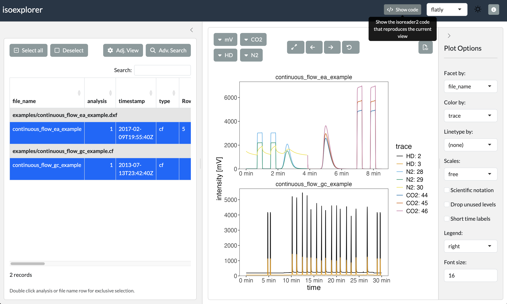
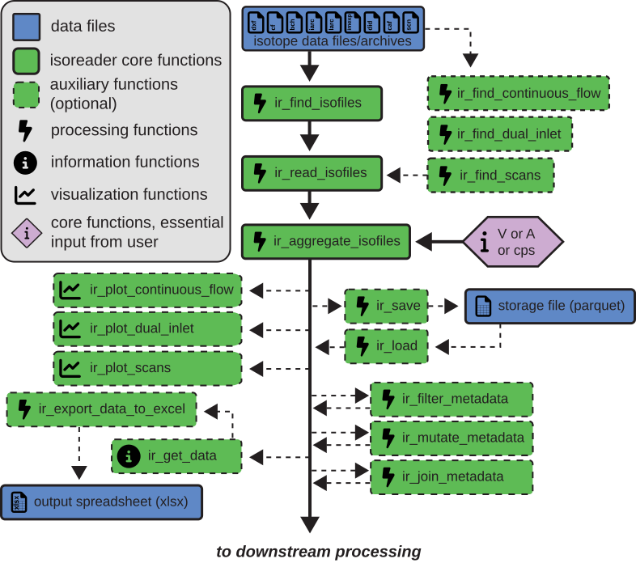
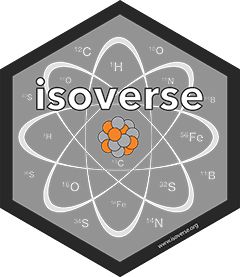

<!-- README.md is generated from README.Rmd. Please edit that file -->

```{r, include = FALSE}
knitr::opts_chunk$set(
  collapse = FALSE,
  comment = "",
  fig.path = "man/figures/README-",
  out.width = "100%",
  dpi = 300
)

# README.md is plain GitHub markdown, which cannot render terminal colors or
# hyperlinks — force cli to plain text so the cli output is not littered with
# raw ANSI escape codes and broken file-link sequences. `cli.width` is pinned so
# the messages still wrap onto multiple lines (otherwise cli stops wrapping once
# it no longer detects a terminal). The pkgdown index keeps its fansi-rendered
# colors (it is built with `generating_pkgdown_index = TRUE`). The previous
# option values are restored once the document is knit (via the `document` hook)
# so rendering the README in an interactive session does not leave cli
# colors/hyperlinks/width permanently overridden.
if (!isTRUE(params$generating_pkgdown_index)) {
  old_cli_opts <- options(
    cli.num_colors = 1,
    cli.hyperlink = FALSE,
    cli.width = 80
  )
  # prefix all output (printed results as well as messages) with "> " so it is
  # clearly distinguishable from the input code in the merged GitHub code blocks
  # (the pkgdown index keeps its default, unprefixed output)
  knitr::opts_chunk$set(comment = ">")
  knitr::knit_hooks$set(document = function(x) {
    options(old_cli_opts)
    x
  })
}
```

# isoreader2 <a href='https://isoreader2.isoverse.org/'>  </a>

<!-- badges: start -->
  [](https://isoreader2.isoverse.org/)
  [](https://cran.r-project.org/package=isoreader2)
  [](https://lifecycle.r-lib.org/articles/stages.html)
  [](https://github.com/isoverse/isoreader2/actions)
  [](https://app.codecov.io/gh/isoverse/isoreader2)
  [](https://doi.org/10.21105/joss.02878)
<!-- badges: end -->

## Overview

This package provides easy access to common IRMS (isotope ratio mass spectrometry) file formats, enabling the reading and processing of stable isotope data directly from the data files for platform-independent (Windows, Mac, Linux), efficient, and reproducible data reduction.

[isoreader2](https://isoreader2.isoverse.org/) succeeds the [isoreader](https://isoreader.isoverse.org/) package with a completely new architecture built around the [isoextract](https://github.com/isoverse/IsofileExtractor) command-line tool. This makes [isoreader2](https://isoreader2.isoverse.org/) significantly faster, and more versatile with support for the following file formats:


| Extension | Measurement type | Produced by | 
|-----------|-----------------|-------------|
| [`.dxf`](https://github.com/isoverse/IsofileExtractor/blob/main/docs/isodat_structure.md)     | Continuous flow          | Thermo Fisher Isodat |
| [`.cf`](https://github.com/isoverse/IsofileExtractor/blob/main/docs/isodat_structure.md)      | Continuous flow (legacy) | Thermo Fisher Isodat |
| [`.bch`](https://github.com/isoverse/IsofileExtractor/blob/main/docs/bch_structure.md)        | Continuous flow          | SerCon Callisto      |
| [`.iarc`](https://github.com/isoverse/IsofileExtractor/blob/main/docs/iarc_larc_structure.md) | Continuous flow          | Elementar IonOS      | 
| [`.larc`](https://github.com/isoverse/IsofileExtractor/blob/main/docs/iarc_larc_structure.md) | Continuous flow          | Elementar LyticOS    | 
| [`.imexp`](https://github.com/isoverse/IsofileExtractor/blob/main/docs/imexp_structure.md)   | Continuous flow          | Thermo Fisher Qtegra | 
| [`.did`](https://github.com/isoverse/IsofileExtractor/blob/main/docs/isodat_structure.md)     | Dual inlet               | Thermo Fisher Isodat |
| [`.caf`](https://github.com/isoverse/IsofileExtractor/blob/main/docs/isodat_structure.md)     | Dual inlet (legacy)      | Thermo Fisher Isodat | 
| [`.scn`](https://github.com/isoverse/IsofileExtractor/blob/main/docs/isodat_structure.md)     | Scan                     | Thermo Fisher Isodat | 

## Installation

You can install the current CRAN version of [isoreader2](https://isoreader2.isoverse.org/) with:

``` r
# install the isoreader2 package
install.packages("isoreader2")
# check/install isoextract
isoreader2::ir_check_isoextract()
```

### Development version

To use the latest updates, you can install the development version of [isoreader2](https://isoreader2.isoverse.org/) from [GitHub](https://github.com/isoverse/isoreader2) as shown below. If you are on Windows, make sure to install the equivalent version of [Rtools](https://cran.r-project.org/bin/windows/Rtools/) for your
version of R (e.g. for the latest R 4.5 and 4.6, use [RTools4.5](https://cran.r-project.org/bin/windows/Rtools/rtools45/rtools.html) - you can find out which version you have with `getRversion()` from an R console).

``` r
# checks that you are set up to build R packages from source
if (!requireNamespace("pkgbuild", quietly = TRUE)) {
  install.packages("pkgbuild")
}
pkgbuild::check_build_tools()

# installs the latest isoreader2 package from GitHub
if (!requireNamespace("pak", quietly = TRUE)) {
  install.packages("pak")
}
pak::pak("isoverse/isoreader2")

# check/install isoextract
isoreader2::ir_check_isoextract()
```

## Show me some code

```{r, include = FALSE}
# remove all files in the examples folder
unlink(list.files("examples", full.names = TRUE))
```

```{r "continuous_flow_example", message=FALSE, fig.width = 8, fig.height = 6, fig.cap = "Plot of continuous flow examples"}
# load library
library(isoreader2)

# copy the bundled example files into a local "examples" folder
data_folder <- ir_copy_examples()

# load data
dataset <-
  data_folder |>
  ir_find_continuous_flow() |>
  ir_read_isofiles() |>
  ir_aggregate_isofiles("mV")

# visualize data for each file
dataset |> ir_plot_continuous_flow(facet = file_name)
```

```{r "continuous_flow_example_w_ratios", message=FALSE, fig.width = 8, fig.height = 6, fig.cap = "Time slice of continuous flow examples with ratios"}
# visualize CO2 with ratios and a specific time window
dataset |>
  ir_calculate_ratios(normalize_ratios = median) |>
  ir_plot_continuous_flow(
    species = "CO2",
    time_window.min = c(4.5, 8.5)
  )
```

## Show me more details

```{r, include = FALSE}
dir.create("tmp/project/data", recursive = TRUE, showWarnings = FALSE)
# remove cached .json sidecars so the read below re-extracts from the originals
unlink(list.files("examples", "\\.json$", full.names = TRUE))
```

### Read isotope data files

```{r}
# load library
library(isoreader2)

# specify where the data files are located (relative or absolute path)
data_folder <- "examples"

# search for dual inlet files (all known file types) in that folder
# (or use ir_find_continuous_flow or ir_find_scans instead)
file_paths <- data_folder |> ir_find_dual_inlet()

# read the files
isofiles <- file_paths |> ir_read_isofiles()
# show information about the files
isofiles
```

### Aggregate the data

```{r}
# aggregate the data from the read files specifying which units to use
# (mV, V, nA, A, cps, etc.), conversion via resistor values happens automatically
dataset <- isofiles |> ir_aggregate_isofiles("V")
# show the available data that was aggregated  metadata is all the available
# sequence information from the different file types
dataset
```

### Visualize the data

```{r "dual_inlet_example", fig.width = 8, fig.height = 7, fig.cap="Plot of dual inlet examples"}
# filter the data by a metadata field and mass range and plot it
# (use ir_plot_continuous_flow() and ir_plot_scans(), respectively)
library(ggplot2)
dataset |>
  ir_filter_metadata(file_name == "caf_dual_inlet_example") |>
  ir_calculate_ratios() |>
  ir_plot_dual_inlet(mass = c(44:48)) +
  # use ggplot2 to modify with custom theming (or any other ggplot elements)
  theme(strip.text = element_text(size = 30))
```

### Export the data

```{r}
# get the data of interest (here, metadata and dual inlet cycles data)
# and export both into one excel file (one sheet per data set)
ir_export_to_excel(
  metadata = dataset |> ir_get_metadata(),
  cycles = dataset |> ir_get_cycles(),
  file = "my_export.xlsx"
)
```

```{r, include = FALSE}
unlink("my_export.xlsx")
unlink("tmp/project", recursive = TRUE, force = TRUE)
unlink("examples", recursive = TRUE, force = TRUE)
```

### Bonus: explore isofiles interactively

```{r, eval = FALSE}
# you can also use the isoexplorer package to explore isofiles
# interactively and generate visualization code from the GUI
# (use ie_explore_continuous_flow/dual_inlet/scans)
if (!requireNamespace("isoexplorer", quietly = TRUE)) {
  pak::pak("isoverse/isoexplorer")
}
example_files <- ir_copy_examples() |> ir_find_isofiles() |> ir_read_isofiles()
example_files |> isoexplorer::ie_explore_continuous_flow()
```



## Package structure

```{r}
#| echo: false
#| warning: false
#| results: asis
if (params$generating_pkgdown_index) {
  # if we're in index.md
  cat(
    "<p>Click on the individual functions to jump straight to their documenation.</p>\n\n```{=html}\n"
  )
  readLines("man/figures/isoreader2_flowchart.svg") |> cat(sep = "\n")
  cat("\n```\n\n")
} else {
  # if we're making README.md
  cat(
    "[](https://isoreader2.isoverse.org/#package-structure)"
  )
}
```

```{r}
#| label: generate pkgdown index.md
#| include: false
# trigger index.md generation
if (!params$generating_pkgdown_index) {
  # Use knitr::knit() directly (not rmarkdown::render) so that ```{=html} fences
  # are written verbatim — rmarkdown's md_document runs Pandoc which strips them.
  xfun::Rscript_call(function() {
    env <- new.env(parent = globalenv())
    env$params <- list(generating_pkgdown_index = TRUE)
    knitr::knit(
      "README.Rmd",
      output = "pkgdown/index.md",
      envir = env,
      quiet = TRUE
    )
  })
}
```


## Getting help

If you encounter a bug, please file an issue with a minimal reproducible example on [GitHub](https://github.com/isoverse/isoreader2/issues). Example files are very helpful for fixing bugs so please consider including an example data file (you will have to attach it as a zip archive).

## isoverse <a href='https://www.isoverse.org/'></a>

This package is part of the isoverse suite of data tools for stable isotopes. If you like the functionality that isoverse packages provide, please help us spread the word and include an isoverse or individual package logo on one of your posters or slides. All logos are posted in high resolution in [this repository](https://github.com/isoverse/logos). If you have suggestions for new features or other constructive feedback, please let us know on this short [feedback form](https://www.isoverse.org/feedback/).

## Funding <a href='https://www.nsf.gov/'></a>

This project is supported by a grant from the US National Science Foundation ([EAR-2411458](https://www.nsf.gov/awardsearch/show-award/?AWD_ID=2411458)) to Sebastian Kopf. 
