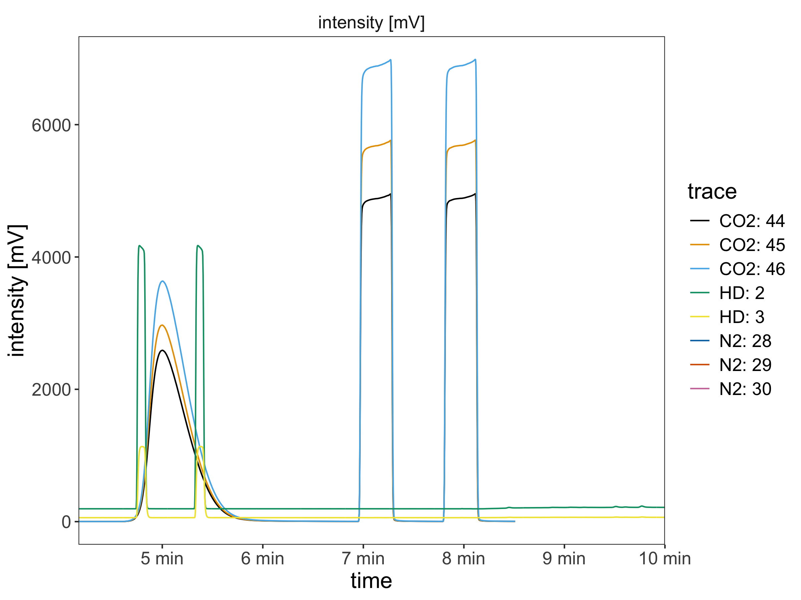
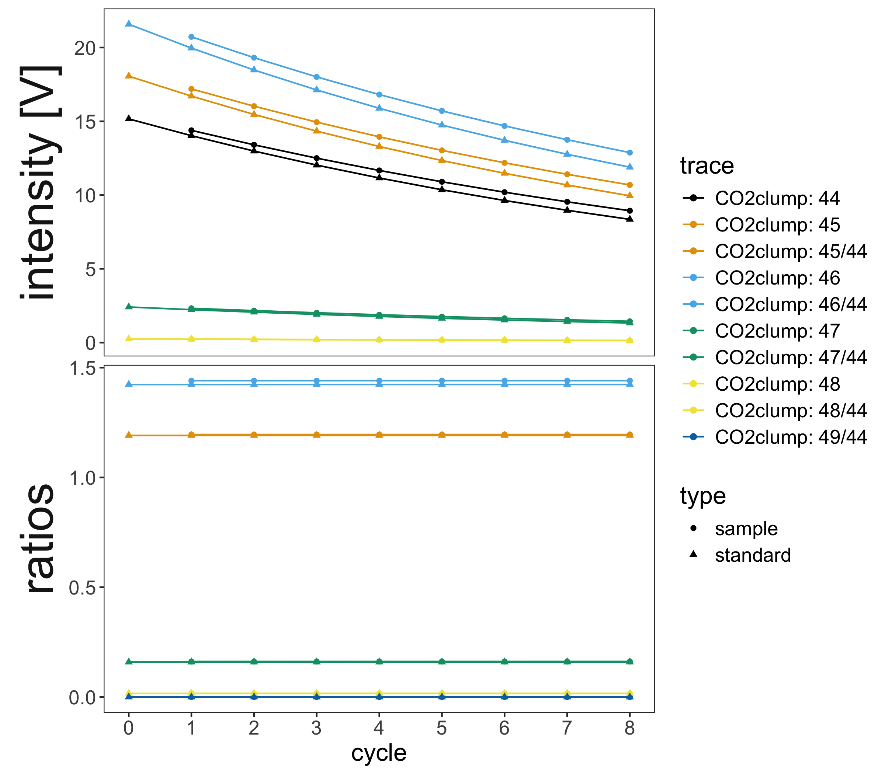

<!-- README.md is generated from README.Rmd. Please edit that file -->

# isoreader2 <a href='https://isoreader2.isoverse.org/'>  </a>

<!-- badges: start -->

[](https://isoreader2.isoverse.org/)
[](https://github.com/isoverse/isoreader2/actions)
[](https://app.codecov.io/gh/isoverse/isoreader2)
<!-- badges: end -->

## Overview

This package provides easy access to common IRMS (isotope ratio mass
spectrometry) file formats, enabling the reading and processing of
stable isotope data directly from the data files for
platform-independent (Windows, Mac, Linux), efficient, and reproducible
data reduction.

[isoreader2](https://isoreader2.isoverse.org/) succeeds the
[isoreader](https://isoreader.isoverse.org/) package with a completely
new architecture built around the
[isoextract](https://github.com/isoverse/IsofileExtractor) command-line
tool. This makes [isoreader2](https://isoreader2.isoverse.org/)
signifcantely faster, and more versatile with support for the following
file formats:

| Extension | Measurement type | Produced by |
|----|----|----|
| [`.dxf`](https://github.com/isoverse/IsofileExtractor/blob/main/docs/isodat_structure.md) | Continuous flow | Thermo Fisher Isodat |
| [`.cf`](https://github.com/isoverse/IsofileExtractor/blob/main/docs/isodat_structure.md) | Continuous flow (legacy) | Thermo Fisher Isodat |
| [`.bch`](https://github.com/isoverse/IsofileExtractor/blob/main/docs/bch_structure.md) | Continuous flow | SerCon Callisto |
| [`.iarc`](https://github.com/isoverse/IsofileExtractor/blob/main/docs/iarc_larc_structure.md) | Continuous flow | Elementar IonOS |
| [`.larc`](https://github.com/isoverse/IsofileExtractor/blob/main/docs/iarc_larc_structure.md) | Continuous flow | Elementar LyticOS |
| [`.imexp`](https://github.com/isoverse/IsofileExtractor/blob/main/docs/imexp_structure.md)\* | Continuous flow | Thermo Fisher Qtegra |
| [`.did`](https://github.com/isoverse/IsofileExtractor/blob/main/docs/isodat_structure.md) | Dual inlet | Thermo Fisher Isodat |
| [`.caf`](https://github.com/isoverse/IsofileExtractor/blob/main/docs/isodat_structure.md) | Dual inlet (legacy) | Thermo Fisher Isodat |
| [`.scn`](https://github.com/isoverse/IsofileExtractor/blob/main/docs/isodat_structure.md) | Scan | Thermo Fisher Isodat |

> *\* the first step of reading Qtegra notebooks (extraction of the
> virtual file system) requires a Windows computer at present but we’re
> working on a solution that works on all major operating systems*

## Installation

[isoreader2](https://isoreader2.isoverse.org/) is not yet on the
Comprehensive R Archive Network (CRAN) but you can install the latest
version from [GitHub](https://github.com/isoverse/isoreader2) as shown
below. If you are on Windows, make sure to install the equivalent
version of [Rtools](https://cran.r-project.org/bin/windows/Rtools/) for
your version of R (e.g. for the latest R 4.5 and 4.6, use
[RTools4.5](https://cran.r-project.org/bin/windows/Rtools/rtools45/rtools.html) -
you can find out which version you have with `getRversion()` from an R
console).

``` r
# checks that you are set up to build R packages from source
if (!requireNamespace("pkgbuild", quietly = TRUE)) {
  install.packages("pkgbuild")
}
pkgbuild::check_build_tools()

# installs the latest isoreader2 package from GitHub
if (!requireNamespace("pak", quietly = TRUE)) {
  install.packages("pak")
}
pak::pak("isoverse/isoreader2")

# check/install isoextract
isoreader2::ir_check_isoextract()
```

## Show me some code

``` r
# load library
library(isoreader2)

# load data
dataset <-
  ir_examples_folder() |>
  ir_find_continuous_flow() |>
  ir_read_isofiles() |>
  ir_aggregate_isofiles("mV")

# visualize data
dataset |>
  ir_plot_continuous_flow()
```



## Show me more details

### Read isotope data files

``` r
# load library
library(isoreader2)

# specify where the data files are located (relative or absolute path)
data_folder <- "tmp/project/data"

# search for dual inlet files (all known file types) in that folder
# (or use ir_find_continuous_flow or ir_find_scans instead)
file_paths <- ir_find_dual_inlet(data_folder)

# for this example, we use the example files bundled with the package
# instead (remove this line if working with your own data)
file_paths <- ir_examples_folder() |> ir_find_dual_inlet()

# read the files
isofiles <- file_paths |> ir_read_isofiles()
```

    > ✔ [365ms] ir_extract_isofiles() finished extracting 2 files/archives

    > ✔ [156ms] ir_read_isofiles() finished reading 2 isotope data files/archives

``` r
# show information about the files
isofiles
```

    > ─────── 2 isofiles with 2 analyses - combine with ir_aggregate_isofiles() ──────

    > 1. caf_dual_inlet_example.caf: with 8 sample/standard cycles for CO2clump
    > (masses 44, 45, 46, 47, 48, 49, 44, 45, 46, 47, 48, 49, 44, 45, 46, 47, 48, 49,
    > …, 48, and 49); 21 metadata columns
    > 2. did_dual_inlet_example.did: with 7 sample/standard cycles for CO2+ (masses
    > 44, 45, 46, 47, 48, 49, 44, 45, 46, 47, 48, 49, 44, 45, 46, 47, 48, 49, …, 48,
    > and 49); 17 metadata columns

### Aggregate the data

``` r
# aggregate the data from the read files specifying which units to use
# (mV, V, nA, A, cps, etc.), conversion via resistor values happens automatically
dataset <- isofiles |> ir_aggregate_isofiles("V")
```

    > ✔ [84ms] ir_aggregate_isofiles() aggregated metadata (2) and cycles (192,
    > intensity in V) from 2 files using the standard aggregator

``` r
# show the available data that was aggregated  metadata is all the available
# sequence information from the different file types
dataset
```

    > ─ aggregated data from 2 isofiles with 2 analyses - retrieve with ir_get_data( ─

    > → metadata (2): uidx, file_path, file_name, analysis, timestamp, type,
    > h3_factor (all NA), Line, Peak Center, Pressadjust, Background, Reference
    > Refill (1 NA), Weight [mg] (1 NA), Sample (1 NA), Identifier 1, Identifier 2,
    > Analysis, Comment, Preparation, Pre Script (1 NA), Post Script, Method

    > → cycles (192): uidx, analysis, species, cycle, type, mass, trace, intensity.V;
    > (not aggregated: channel)

    > → problems: has no issues

### Visualize the data

``` r
# filter the data for by a metadata field and plot it
# use ir_plot_continuous_flow() and ir_plot_scans(), respectively
dataset |>
  ir_filter_metadata(file_name == "caf_dual_inlet_example") |>
  ir_plot_dual_inlet()
```



### Export the data

``` r
# get the data of interest (here, metadata and dual inlet cycles data)
# and export both into one excel file (one sheet per data set)
ir_export_to_excel(
  metadata = dataset |> ir_get_metadata(),
  cycles = dataset |> ir_get_cycles(),
  file = "my_export.xlsx"
)
```

    > ✔ [2ms] ir_get_data() retrieved 2 records from metadata

    > ✔ [3ms] ir_get_data() retrieved 192 records from the combination of metadata
    > (2) and cycles (192) via uidx and analysis

    > ✔ [287ms] ir_export_to_excel() exported 2 rows of metadata and 192 rows of
    > cycles to 'my_export.xlsx'

## Package structure

[](https://isoreader2.isoverse.org/#package-structure)

## Getting help

If you encounter a bug, please file an issue with a minimal reproducible
example on [GitHub](https://github.com/isoverse/isoreader2/issues).
Example files are very helpful for fixing bugs so please consider
including an example data file (you will have to attach it as a zip
archive).

## isoverse <a href='http://www.isoverse.org'></a>

This package is part of the isoverse suite of data tools for stable
isotopes. If you like the functionality that isoverse packages provide,
please help us spread the word and include an isoverse or individual
package logo on one of your posters or slides. All logos are posted in
high resolution in [this repository](https://github.com/isoverse/logos).
If you have suggestions for new features or other constructive feedback,
please let us know on this short [feeback
form](https://www.isoverse.org/feedback/).

## Funding <a href='https://www.nsf.gov/'></a>

This project is supported by a grant from the US National Science
Foundation
([EAR-2411458](https://www.nsf.gov/awardsearch/show-award?AWD_ID=2411458))
to Sebastian Kopf.
