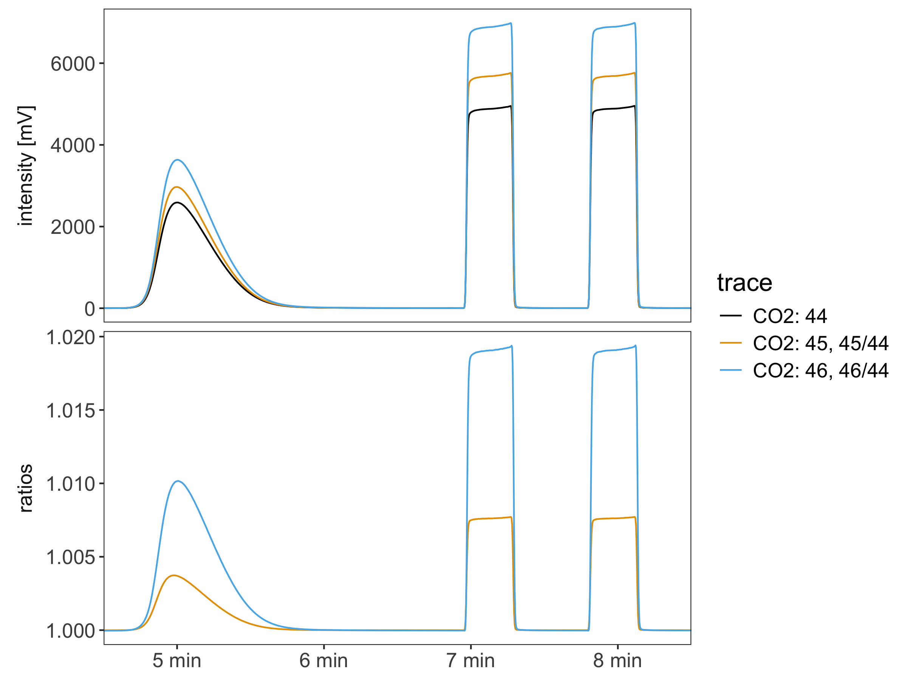

<!-- README.md is generated from README.Rmd. Please edit that file -->

# isoreader2 <a href='https://isoreader2.isoverse.org/'>  </a>

<!-- badges: start -->

[](https://isoreader2.isoverse.org/)
[](https://cran.r-project.org/package=isoreader2)
[](https://lifecycle.r-lib.org/articles/stages.html)
[](https://github.com/isoverse/isoreader2/actions)
[](https://app.codecov.io/gh/isoverse/isoreader2)
[](https://doi.org/10.21105/joss.02878)
<!-- badges: end -->

## Overview

This package provides easy access to common IRMS (isotope ratio mass
spectrometry) file formats, enabling the reading and processing of
stable isotope data directly from the data files for
platform-independent (Windows, Mac, Linux), efficient, and reproducible
data reduction.

[isoreader2](https://isoreader2.isoverse.org/) succeeds the
[isoreader](https://isoreader.isoverse.org/) package with a completely
new architecture built around the
[isoextract](https://github.com/isoverse/IsofileExtractor) command-line
tool. This makes [isoreader2](https://isoreader2.isoverse.org/)
significantly faster, and more versatile with support for the following
file formats:

| Extension | Measurement type | Produced by |
|----|----|----|
| [`.dxf`](https://github.com/isoverse/IsofileExtractor/blob/main/docs/isodat_structure.md) | Continuous flow | Thermo Fisher Isodat |
| [`.cf`](https://github.com/isoverse/IsofileExtractor/blob/main/docs/isodat_structure.md) | Continuous flow (legacy) | Thermo Fisher Isodat |
| [`.bch`](https://github.com/isoverse/IsofileExtractor/blob/main/docs/bch_structure.md) | Continuous flow | SerCon Callisto |
| [`.iarc`](https://github.com/isoverse/IsofileExtractor/blob/main/docs/iarc_larc_structure.md) | Continuous flow | Elementar IonOS |
| [`.larc`](https://github.com/isoverse/IsofileExtractor/blob/main/docs/iarc_larc_structure.md) | Continuous flow | Elementar LyticOS |
| [`.imexp`](https://github.com/isoverse/IsofileExtractor/blob/main/docs/imexp_structure.md) | Continuous flow | Thermo Fisher Qtegra |
| [`.did`](https://github.com/isoverse/IsofileExtractor/blob/main/docs/isodat_structure.md) | Dual inlet | Thermo Fisher Isodat |
| [`.caf`](https://github.com/isoverse/IsofileExtractor/blob/main/docs/isodat_structure.md) | Dual inlet (legacy) | Thermo Fisher Isodat |
| [`.scn`](https://github.com/isoverse/IsofileExtractor/blob/main/docs/isodat_structure.md) | Scan | Thermo Fisher Isodat |

## Installation

You can install the current CRAN version of
[isoreader2](https://isoreader2.isoverse.org/) with:

``` r
# install the isoreader2 package
install.packages("isoreader2")
# check/install isoextract
isoreader2::ir_check_isoextract()
```

### Development version

To use the latest updates, you can install the development version of
[isoreader2](https://isoreader2.isoverse.org/) from
[GitHub](https://github.com/isoverse/isoreader2) as shown below. If you
are on Windows, make sure to install the equivalent version of
[Rtools](https://cran.r-project.org/bin/windows/Rtools/) for your
version of R (e.g. for the latest R 4.5 and 4.6, use
[RTools4.5](https://cran.r-project.org/bin/windows/Rtools/rtools45/rtools.html) -
you can find out which version you have with `getRversion()` from an R
console).

``` r
# checks that you are set up to build R packages from source
if (!requireNamespace("pkgbuild", quietly = TRUE)) {
  install.packages("pkgbuild")
}
pkgbuild::check_build_tools()

# installs the latest isoreader2 package from GitHub
if (!requireNamespace("pak", quietly = TRUE)) {
  install.packages("pak")
}
pak::pak("isoverse/isoreader2")

# check/install isoextract
isoreader2::ir_check_isoextract()
```

## Show me some code

``` r
# load library
library(isoreader2)

# copy the bundled example files into a local "examples" folder
data_folder <- ir_copy_examples()

# load data
dataset <-
  data_folder |>
  ir_find_continuous_flow() |>
  ir_read_isofiles() |>
  ir_aggregate_isofiles("mV")

# visualize data for each file
dataset |> ir_plot_continuous_flow(facet = file_name)
```

<div class="figure">


<p class="caption">

Plot of continuous flow examples
</p>

</div>

``` r
# visualize CO2 with ratios and a specific time window
dataset |>
  ir_calculate_ratios(normalize_ratios = median) |>
  ir_plot_continuous_flow(
    species = "CO2",
    time_window.min = c(4.5, 8.5)
  )
```

<div class="figure">


<p class="caption">

Time slice of continuous flow examples with ratios
</p>

</div>

## Show me more details

### Read isotope data files

``` r
# load library
library(isoreader2)

# specify where the data files are located (relative or absolute path)
data_folder <- "examples"

# search for dual inlet files (all known file types) in that folder
# (or use ir_find_continuous_flow or ir_find_scans instead)
file_paths <- data_folder |> ir_find_dual_inlet()

# read the files
isofiles <- file_paths |> ir_read_isofiles()
```

<PRE class="fansi fansi-message"><CODE>&gt; <span style='color: #00BB00;'>✔</span> <span style='color: #B2B2B2;'>[115ms]</span> <span style='font-weight: bold;'>ir_extract_isofiles()</span> finished extracting 1 file/archive
</CODE></PRE>

<PRE class="fansi fansi-message"><CODE>&gt; <span style='color: #00BB00;'>✔</span> <span style='color: #B2B2B2;'>[183ms]</span> <span style='font-weight: bold;'>ir_read_isofiles()</span> finished reading 1 isotope data file/archive
</CODE></PRE>

``` r
# show information about the files
isofiles
```

<PRE class="fansi fansi-message"><CODE>&gt; ─────── <span style='font-weight: bold;'>1 isofile with 1 analysis - process with ir_aggregate_isofiles()</span> ───────
</CODE></PRE>

<PRE class="fansi fansi-message"><CODE>&gt; 1. <span style='color: #0000BB;'>caf_dual_inlet_example.caf</span>: with <span style='color: #00BBBB;'>8</span> sample/standard cycles for <span style='color: #BB00BB;'>CO2clump</span>
&gt; (masses <span style='color: #00BB00;'>44</span>, <span style='color: #00BB00;'>45</span>, <span style='color: #00BB00;'>46</span>, <span style='color: #00BB00;'>47</span>, <span style='color: #00BB00;'>48</span>, and <span style='color: #00BB00;'>49</span>); <span style='color: #00BBBB;'>21</span> metadata columns
</CODE></PRE>

### Aggregate the data

``` r
# aggregate the data from the read files specifying which units to use
# (mV, V, nA, A, cps, etc.), conversion via resistor values happens automatically
dataset <- isofiles |> ir_aggregate_isofiles("V")
```

<PRE class="fansi fansi-message"><CODE>&gt; <span style='color: #00BB00;'>✔</span> <span style='color: #B2B2B2;'>[47ms]</span> <span style='font-weight: bold;'>ir_aggregate_isofiles()</span> aggregated <span style='color: #0000BB;'>metadata</span> (1) and <span style='color: #0000BB;'>cycles</span> (102,
&gt; <span style='color: #00BB00;'>intensity</span> in <span style='color: #BB00BB;'>V</span>) from 1 file using the <span style='font-weight: bold; font-style: italic;'>standard</span> aggregator
</CODE></PRE>

``` r
# show the available data that was aggregated  metadata is all the available
# sequence information from the different file types
dataset
```

<PRE class="fansi fansi-message"><CODE>&gt; ─ <span style='font-weight: bold;'>aggregated data from 1 isofiles with 1 analysis - retrieve with ir_get_data(</span> ─
</CODE></PRE>

<PRE class="fansi fansi-message"><CODE>&gt; → <span style='color: #0000BB;'>metadata</span> (1): <span style='color: #00BB00;'>uidx</span>, <span style='color: #00BB00;'>file_path</span>, <span style='color: #00BB00;'>file_name</span>, <span style='color: #00BB00;'>analysis</span>, <span style='color: #00BB00;'>timestamp</span>, <span style='color: #00BB00;'>type</span>,
&gt; <span style='color: #00BB00;'>h3_factor</span> (<span style='color: #BBBB00;'>all NA</span>), <span style='color: #00BB00;'>Line</span>, <span style='color: #00BB00;'>Peak Center</span>, <span style='color: #00BB00;'>Pressadjust</span>, <span style='color: #00BB00;'>Background</span>, <span style='color: #00BB00;'>Reference</span>
&gt; <span style='color: #00BB00;'>Refill</span>, <span style='color: #00BB00;'>Weight [mg]</span>, <span style='color: #00BB00;'>Sample</span>, <span style='color: #00BB00;'>Identifier 1</span>, <span style='color: #00BB00;'>Identifier 2</span>, <span style='color: #00BB00;'>Analysis</span>, <span style='color: #00BB00;'>Comment</span>,
&gt; <span style='color: #00BB00;'>Preparation</span>, <span style='color: #00BB00;'>Pre Script</span>, <span style='color: #00BB00;'>Post Script</span>, <span style='color: #00BB00;'>Method</span>
</CODE></PRE>

<PRE class="fansi fansi-message"><CODE>&gt; → <span style='color: #0000BB;'>cycles</span> (102): <span style='color: #00BB00;'>uidx</span>, <span style='color: #00BB00;'>analysis</span>, <span style='color: #00BB00;'>species</span>, <span style='color: #00BB00;'>cycle</span>, <span style='color: #00BB00;'>type</span>, <span style='color: #00BB00;'>mass</span>, <span style='color: #00BB00;'>intensity.V</span>; (<span style='font-style: italic;'>not</span>
&gt; <span style='font-style: italic;'>aggregated</span>: <span style='color: #BBBB00; font-style: italic;'>channel</span>)
</CODE></PRE>

<PRE class="fansi fansi-message"><CODE>&gt; → <span style='color: #0000BB;'>problems</span>: has <span style='color: #00BB00;'>no issues</span>
</CODE></PRE>

### Visualize the data

``` r
# filter the data by a metadata field and mass range and plot it
# (use ir_plot_continuous_flow() and ir_plot_scans(), respectively)
library(ggplot2)
dataset |>
  ir_filter_metadata(file_name == "caf_dual_inlet_example") |>
  ir_calculate_ratios() |>
  ir_plot_dual_inlet(mass = c(44:48)) +
  # use ggplot2 to modify with custom theming (or any other ggplot elements)
  theme(strip.text = element_text(size = 30))
```

<PRE class="fansi fansi-message"><CODE>&gt; <span style='color: #00BB00;'>✔</span> <span style='color: #B2B2B2;'>[3ms]</span> <span style='font-weight: bold;'>ir_calculate_ratios()</span> calculated 85 ratios and added <span style='color: #00BB00;'>ratio_name</span> and
&gt; <span style='color: #00BB00;'>ratio</span> columns to the <span style='color: #0000BB;'>cycles</span>
</CODE></PRE>

<div class="figure">


<p class="caption">

Plot of dual inlet examples
</p>

</div>

### Export the data

``` r
# get the data of interest (here, metadata and dual inlet cycles data)
# and export both into one excel file (one sheet per data set)
ir_export_to_excel(
  metadata = dataset |> ir_get_metadata(),
  cycles = dataset |> ir_get_cycles(),
  file = "my_export.xlsx"
)
```

<PRE class="fansi fansi-message"><CODE>&gt; <span style='color: #00BB00;'>✔</span> <span style='color: #B2B2B2;'>[2ms]</span> <span style='font-weight: bold;'>ir_get_data()</span> retrieved 1 records from <span style='color: #0000BB;'>metadata</span>
</CODE></PRE>

<PRE class="fansi fansi-message"><CODE>&gt; <span style='color: #00BB00;'>✔</span> <span style='color: #B2B2B2;'>[3ms]</span> <span style='font-weight: bold;'>ir_get_data()</span> retrieved 102 records from the combination of <span style='color: #0000BB;'>metadata</span>
&gt; (1) and <span style='color: #0000BB;'>cycles</span> (102) via <span style='color: #00BB00;'>uidx</span> and <span style='color: #00BB00;'>analysis</span>
</CODE></PRE>

<PRE class="fansi fansi-message"><CODE>&gt; <span style='color: #00BB00;'>✔</span> <span style='color: #B2B2B2;'>[407ms]</span> <span style='font-weight: bold;'>ir_export_to_excel()</span> exported 1 row of <span style='color: #00BB00;'>metadata</span> and 102 rows of
&gt; <span style='color: #00BB00;'>cycles</span> to <span style='color: #0000BB;'>my_export.xlsx</span>
</CODE></PRE>

### Bonus: explore isofiles interactively

``` r
# you can also use the isoexplorer package to explore isofiles
# interactively and generate visualization code from the GUI
# (use ie_explore_continuous_flow/dual_inlet/scans)
if (!requireNamespace("isoexplorer", quietly = TRUE)) {
  pak::pak("isoverse/isoexplorer")
}
example_files <- ir_copy_examples() |> ir_find_isofiles() |> ir_read_isofiles()
example_files |> isoexplorer::ie_explore_continuous_flow()
```

<figure>

<figcaption aria-hidden="true">Isoexplorer screenshot</figcaption>
</figure>

## Package structure

[](https://isoreader2.isoverse.org/#package-structure)

## Getting help

If you encounter a bug, please file an issue with a minimal reproducible
example on [GitHub](https://github.com/isoverse/isoreader2/issues).
Example files are very helpful for fixing bugs so please consider
including an example data file (you will have to attach it as a zip
archive).

## isoverse <a href='https://www.isoverse.org/'></a>

This package is part of the isoverse suite of data tools for stable
isotopes. If you like the functionality that isoverse packages provide,
please help us spread the word and include an isoverse or individual
package logo on one of your posters or slides. All logos are posted in
high resolution in [this repository](https://github.com/isoverse/logos).
If you have suggestions for new features or other constructive feedback,
please let us know on this short [feedback
form](https://www.isoverse.org/feedback/).

## Funding <a href='https://www.nsf.gov/'></a>

This project is supported by a grant from the US National Science
Foundation
([EAR-2411458](https://www.nsf.gov/awardsearch/show-award/?AWD_ID=2411458))
to Sebastian Kopf.
