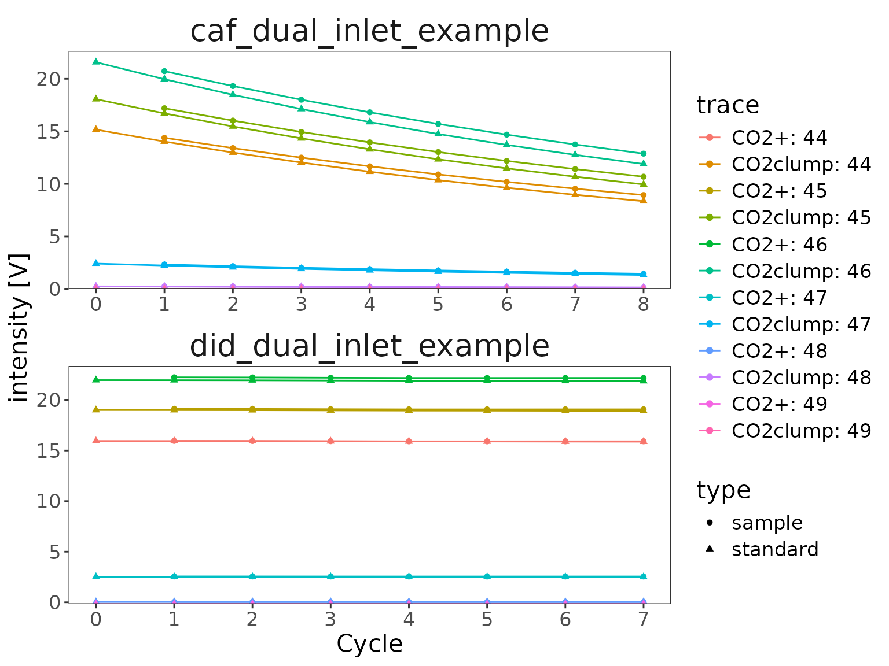
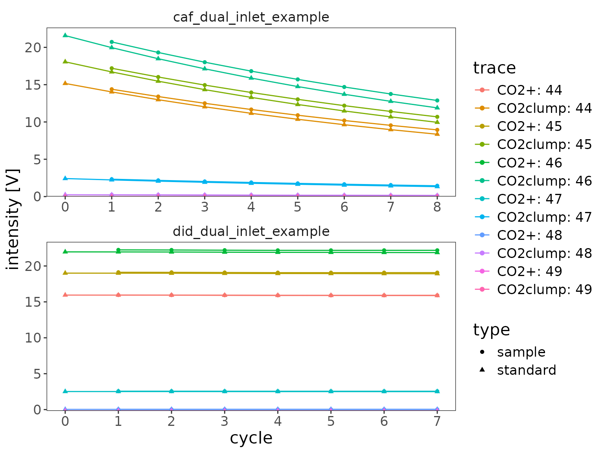
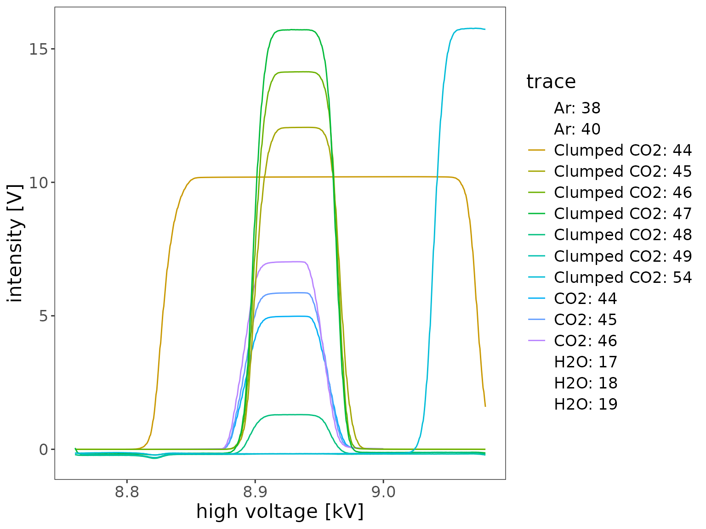

# Functionality Guide

> This step-by-step functionality guide is still in development.
> Eventually all functions in the [package structure
> flowchart](https://isoreader2.isoverse.org/index.html#package-structure)
> will be covered with detailed examples. All functions below labelled
> with an `*` are required steps of the standard data reading flow.
> Everything else is optional. Rarely used additional features that are
> mentioned here but not part of the standard flowchart are labeled as
> `bonus`.

``` r

# libraries
library(isoreader2) # load isoreader2 R package
library(dplyr) # for select syntax and mutating data frames
```

## Reading isotope files

The first step is finding and reading your isotope data files.
isoreader2 supports a range of continuous flow, dual inlet, and scan
file formats:

``` r

# supported file types
ir_get_supported_file_types()
```

``` fansi
# A tibble: 9 × 3
  file_type min_isoextract_version vendor_software
  <chr>     <chr>                  <chr>          
1 dxf       0.2.0                  Isodat         
2 cf        0.2.0                  Isodat         
3 iarc      0.2.0                  IonOS          
4 larc      0.2.0                  LyticOS        
5 bch       0.2.0                  Callisto       
6 imexp     0.2.0                  Qtegra         
7 did       0.2.0                  Isodat         
8 caf       0.2.0                  Isodat         
9 scn       0.2.0                  Isodat         
```

### `ir_find_isofiles()` \*

Point isoreader2 at a folder to discover the data files inside it. The
generic
[`ir_find_isofiles()`](https://isoreader2.isoverse.org/reference/ir_find_isofiles.md)
finds all supported types, while
[`ir_find_continuous_flow()`](https://isoreader2.isoverse.org/reference/ir_find_isofiles.md),
[`ir_find_dual_inlet()`](https://isoreader2.isoverse.org/reference/ir_find_isofiles.md),
and
[`ir_find_scans()`](https://isoreader2.isoverse.org/reference/ir_find_isofiles.md)
narrow the search to specific measurement types. The bundled example
files are available via
[`ir_examples_folder()`](https://isoreader2.isoverse.org/reference/ir_examples_folder.md).

``` r

# path to your data folder (here the local copy of the example files)
data_folder <- file.path("tmp")

# find continuous flow files (.dxf/.cf) in the folder
file_paths <- data_folder |> ir_find_continuous_flow()

# show what was found
file_paths
```

    [1] "tmp/continuous_flow_ea_example.dxf" "tmp/continuous_flow_gc_example.cf" 

### `ir_read_isofiles()` \*

Read the discovered files. This returns an `ir_isofiles` object - a
tibble with one row per file and the extracted datasets stored in nested
columns.

``` r

# read the files
isofiles <- file_paths |> ir_read_isofiles()
```

``` fansi
→ Trying to install isoextract for your operating system isoextract-linux-x64
  (this requires an internet connection and may take a moment)...
✔ [1.4s] check_assembly() successfully installed isoextract version 0.2.1.0

✔ [189ms] ir_extract_isofiles() finished extracting 2 files/archives

✔ [481ms] ir_read_isofiles() finished reading 2 isotope data files/archives
```

``` r

# show what was read
isofiles
```

``` fansi
─────── 2 isofiles with 2 analyses - combine with ir_aggregate_isofiles() ──────
1. continuous_flow_ea_example.dxf: with 1.1k time points for N2 (masses 28, 29,
and 30); 1.34k time points for CO2 (masses 44, 45, and 46); 20 metadata columns
2. continuous_flow_gc_example.cf:   with 8.6k time points for HD (masses 2 and
3); 19 metadata columns
```

#### bonus combine collections with `c()`

Multiple `ir_isofiles` collections can be combined into one with a
simple [`c()`](https://rdrr.io/r/base/c.html), which row-binds them
while preserving the object type.

``` r

# combine two collections (here just the same files twice for illustration)
c(isofiles, isofiles)
```

``` fansi
─────── 4 isofiles with 4 analyses - combine with ir_aggregate_isofiles() ──────
```

``` fansi
1. continuous_flow_ea_example.dxf: with 1.1k time points for N2 (masses 28, 29,
and 30); 1.34k time points for CO2 (masses 44, 45, and 46); 20 metadata columns
2. continuous_flow_gc_example.cf:   with 8.6k time points for HD (masses 2 and
3); 19 metadata columns
3. continuous_flow_ea_example.dxf: with 1.1k time points for N2 (masses 28, 29,
and 30); 1.34k time points for CO2 (masses 44, 45, and 46); 20 metadata columns
4. continuous_flow_gc_example.cf:   with 8.6k time points for HD (masses 2 and
3); 19 metadata columns
```

#### bonus `ir_save_isofiles()` / `ir_load_isofiles()`

You can store an entire `ir_isofiles` collection to disk (as an RDS
file) and read it back exactly as it was, without re-reading the
original data files.

``` r

# save and reload the read isofiles
isofiles |> ir_save_isofiles(file.path("tmp", "my_isofiles"))
```

``` fansi
✔ [45ms] ir_save_isofiles() saved 2 isofiles to tmp/my_isofiles.rds
```

``` r

reloaded <- ir_load_isofiles(file.path("tmp", "my_isofiles"))
```

``` fansi
✔ [6ms] ir_load_isofiles() loaded 2 isofiles from tmp/my_isofiles.rds
```

## Aggregating data

The nested `ir_isofiles` structure is convenient for reading but not for
analysis. Aggregation pulls the data together into a tidy set of data
frames (metadata, traces, cycles, scans, resistors) that are easy to
work with.

### `ir_aggregate_isofiles()` \*

``` r

# aggregate the data
dataset <- isofiles |> ir_aggregate_isofiles()
```

``` fansi
✔ [248ms] ir_aggregate_isofiles() aggregated metadata (2) and traces (24.5k,
intensity in mV) from 2 files using the standard aggregator
```

``` r

# show all that was recovered
# (as well as what was ignored / not aggregated)
dataset
```

``` fansi
─ aggregated data from 2 isofiles with 2 analyses - retrieve with ir_get_data( ─
```

``` fansi
→ metadata (2): uidx, file_path, file_name, analysis, timestamp, type,
h3_factor (1 NA), Row (1 NA), Peak Center (1 NA), Check Ref. Dilution (1 NA),
H3 Stability (1 NA), H3 Factor (1 NA), Amount (1 NA), Type (1 NA), EA Method (1
NA), Identifier 1, Identifier 2 (1 NA), Analysis, Comment (1 NA), Preparation
(1 NA), Method, Line (1 NA), GC Method (1 NA), AS Sample (1 NA), AS Method (1
NA), Pre Script (all NA), Post Script (all NA)
```

``` fansi
→ traces (24.5k): uidx, analysis, species, mass, trace, time.s, intensity.mV;
(not aggregated: channel)
```

``` fansi
→ problems: has no issues
```

#### bonus `ir_get_aggregator()`

You can optionally use a different aggregator. Besides the default
`standard` aggregator, the package ships (from smallest to largest) the
`metadata` aggregator (metadata only), the `minimal` aggregator
(metadata plus the core data series), and the `extended` aggregator,
which is more elaborate and provides access to additional columns (such
as the resistor/cup configuration and the vendor data table) from the
data files.

``` r

# minimal vs. extended aggregator
ir_get_aggregator("minimal")
```

``` fansi
────────────────────────────── Aggregator minimal ──────────────────────────────
```

``` fansi
Dataset metadata:
 → file_name = as.character(sub(file_name, pattern = "\\.[^.]+$", replacement =
""))
 → analysis = as.integer(analysis)
 → timestamp = as.POSIXct(timestamp)
Dataset traces:
 → analysis = as.integer(analysis)
 → species = as.character(species)
 → mass = as.character(mass)
 → trace = as.character(sprintf(species, mass, fmt = "%s: %s"))
 → time.s = as.numeric(time.s)
 → (intensity\\..*) = as.numeric(all_matches("(intensity\\..*)"))
Dataset cycles:
 → analysis = as.integer(analysis)
 → species = as.character(species)
 → cycle = as.integer(cycle)
 → type = as.character(type)
 → mass = as.character(mass)
 → trace = as.character(sprintf(species, mass, fmt = "%s: %s"))
 → (intensity\\..*) = as.numeric(all_matches("(intensity\\..*)"))
Dataset scans:
 → analysis = as.integer(analysis)
 → species = as.character(species)
 → mass = as.character(mass)
 → trace = as.character(sprintf(species, mass, fmt = "%s: %s"))
 → x = as.numeric(x)
 → (intensity\\..*) = as.numeric(all_matches("(intensity\\..*)"))
```

``` r

ir_get_aggregator("extended")
```

``` fansi
────────────────────────────── Aggregator extended ─────────────────────────────
```

``` fansi
Dataset metadata:
 → file_name = as.character(sub(file_name, pattern = "\\.[^.]+$", replacement =
""))
 → analysis = as.integer(analysis)
 → timestamp = as.POSIXct(timestamp)
 → (.*) = as.character(all_matches("(.*)"))
Dataset traces:
 → analysis = as.integer(analysis)
 → species = as.character(species)
 → mass = as.character(mass)
 → trace = as.character(sprintf(species, mass, fmt = "%s: %s"))
 → time.s = as.numeric(time.s)
 → (intensity\\..*) = as.numeric(all_matches("(intensity\\..*)"))
 → channel = as.integer(channel)
 → config = as.integer(config)
Dataset cycles:
 → analysis = as.integer(analysis)
 → species = as.character(species)
 → cycle = as.integer(cycle)
 → type = as.character(type)
 → mass = as.character(mass)
 → trace = as.character(sprintf(species, mass, fmt = "%s: %s"))
 → (intensity\\..*) = as.numeric(all_matches("(intensity\\..*)"))
 → channel = as.integer(channel)
Dataset scans:
 → analysis = as.integer(analysis)
 → species = as.character(species)
 → mass = as.character(mass)
 → trace = as.character(sprintf(species, mass, fmt = "%s: %s"))
 → x = as.numeric(x)
 → (intensity\\..*) = as.numeric(all_matches("(intensity\\..*)"))
 → channel = as.integer(channel)
Dataset resistors:
 → species = as.character(species)
 → config = as.integer(config)
 → channel = as.integer(channel)
 → mass = as.character(mass)
 → cup = as.integer(cup)
 → resistance.Ohm = as.numeric(resistance.Ohm)
 → nominal.Ohm = as.numeric(nominal.Ohm)
Dataset vendor_data_table:
 → (.*) = keep_as_is(all_matches("(.*)"))
```

``` r

# using the extended aggregator instead of the default (standard)
isofiles |> ir_aggregate_isofiles(aggregator = "extended")
```

``` fansi
✔ [571ms] ir_aggregate_isofiles() aggregated metadata (2), traces (24.5k,
intensity in mV), resistors (8), and vendor_data_table (25) from 2 files using
the extended aggregator
```

``` fansi
─ aggregated data from 2 isofiles with 2 analyses - retrieve with ir_get_data( ─
```

``` fansi
→ metadata (2): uidx, file_path, file_name, analysis, timestamp, type,
h3_factor (1 NA), Row (1 NA), Peak Center (1 NA), Check Ref. Dilution (1 NA),
H3 Stability (1 NA), H3 Factor (1 NA), Amount (1 NA), Type (1 NA), EA Method (1
NA), Identifier 1, Identifier 2 (1 NA), Analysis, Comment (1 NA), Preparation
(1 NA), Method, Line (1 NA), GC Method (1 NA), AS Sample (1 NA), AS Method (1
NA), Pre Script (all NA), Post Script (all NA)
```

``` fansi
→ traces (24.5k): uidx, analysis, species, mass, trace, time.s, intensity.mV,
channel, config (all NA)
```

``` fansi
→ resistors (8): uidx, species, config (all NA), channel, mass, cup,
resistance.Ohm, nominal.Ohm (all NA)
```

``` fansi
→ vendor_data_table (25): uidx, analysis, species, Start [s], Rt [s], End [s],
Ampl 28 [mV] (22 NA), Ampl 29 [mV] (22 NA), Ampl 30 [mV] (22 NA), BGD 28 [mV]
(22 NA), BGD 29 [mV] (22 NA), BGD 30 [mV] (22 NA), Nr., rIntensity 28 [mVs] (22
NA), rIntensity 29 [mVs] (22 NA), rIntensity 30 [mVs] (22 NA), rIntensity All
[mVs], Intensity 28 [Vs] (22 NA), Intensity 29 [Vs] (22 NA), Intensity 30 [Vs]
(22 NA), Intensity All [Vs], Sample Dilution [%] (19 NA), List First Peak (22
NA), rR 29N2/28N2 (22 NA), Is Ref.?, R 29N2/28N2 (22 NA), Ref. Name, rd
29N2/28N2 [per mil] (22 NA), d 29N2/28N2 [per mil] (22 NA), R 15N/14N (22 NA),
δ 15N/14N [per mil] (22 NA), AT% 15N/14N [%] (22 NA), Rps 29N2/28N2 (24 NA),
Ampl 44 [mV] (22 NA), Ampl 45 [mV] (22 NA), Ampl 46 [mV] (22 NA), BGD 44 [mV]
(22 NA), BGD 45 [mV] (22 NA), BGD 46 [mV] (22 NA), rIntensity 44 [mVs] (22 NA),
rIntensity 45 [mVs] (22 NA), rIntensity 46 [mVs] (22 NA), Intensity 44 [Vs] (22
NA), Intensity 45 [Vs] (22 NA), Intensity 46 [Vs] (22 NA), rR 45CO2/44CO2 (22
NA), rR 46CO2/44CO2 (22 NA), R 45CO2/44CO2 (22 NA), rd 45CO2/44CO2 [per mil]
(22 NA), d 45CO2/44CO2 [per mil] (22 NA), R 46CO2/44CO2 (22 NA), rd 46CO2/44CO2
[per mil] (22 NA), d 46CO2/44CO2 [per mil] (22 NA), R 13C/12C (22 NA), δ
13C/12C [per mil] (22 NA), AT% 13C/12C [%] (22 NA), R 18O/16O (22 NA), δ
18O/16O [per mil] (22 NA), AT% 18O/16O [%] (22 NA), R 17O/16O (22 NA), d
17O/16O (22 NA), Rps 45CO2/44CO2 (24 NA), Rps 46CO2/44CO2 (24 NA), Ampl 2 [mV]
(6 NA), Ampl 3 [mV] (6 NA), BGD 2 [mV] (6 NA), BGD 3 [mV] (6 NA), rIntensity 2
[mVs] (6 NA), rIntensity 3 [mVs] (6 NA), Intensity 2 [Vs] (6 NA), Intensity 3
[Vs] (6 NA), rR 3H2/2H2 (6 NA), R 3H2/2H2 (6 NA), rd 3H2/2H2 [per mil] (6 NA),
d 3H2/2H2 [per mil] (6 NA), R 2H/1H (6 NA), δ 2H/1H [per mil] (6 NA), AT% 2H/1H
[%] (6 NA), Rps 3H2/2H2 (20 NA)
```

``` fansi
→ problems: has no issues
```

#### bonus `ir_register_aggregator()`

Or build your own aggregator with
[`ir_start_aggregator()`](https://isoreader2.isoverse.org/reference/ir_aggregator.md)
and/or expand an existing one with
[`ir_add_to_aggregator()`](https://isoreader2.isoverse.org/reference/ir_aggregator.md),
then register it via
[`ir_register_aggregator()`](https://isoreader2.isoverse.org/reference/ir_aggregator.md).
This functionality is rarely needed and thus not part of the package
structure flowchart.

``` r

my_agg <-
  ir_get_aggregator("minimal") |>
  # pull the "Identifier 1" metadata field out under a friendlier name
  ir_add_to_aggregator("metadata", "sample_id", source = "Identifier 1") |>
  ir_register_aggregator(name = "my_aggregator")

# show my aggregator summary
my_agg
```

``` fansi
────────────────────────────── Aggregator minimal ──────────────────────────────
```

``` fansi
Dataset metadata:
 → file_name = as.character(sub(file_name, pattern = "\\.[^.]+$", replacement =
""))
 → analysis = as.integer(analysis)
 → timestamp = as.POSIXct(timestamp)
 → sample_id = as.character(`Identifier 1`)
Dataset traces:
 → analysis = as.integer(analysis)
 → species = as.character(species)
 → mass = as.character(mass)
 → trace = as.character(sprintf(species, mass, fmt = "%s: %s"))
 → time.s = as.numeric(time.s)
 → (intensity\\..*) = as.numeric(all_matches("(intensity\\..*)"))
Dataset cycles:
 → analysis = as.integer(analysis)
 → species = as.character(species)
 → cycle = as.integer(cycle)
 → type = as.character(type)
 → mass = as.character(mass)
 → trace = as.character(sprintf(species, mass, fmt = "%s: %s"))
 → (intensity\\..*) = as.numeric(all_matches("(intensity\\..*)"))
Dataset scans:
 → analysis = as.integer(analysis)
 → species = as.character(species)
 → mass = as.character(mass)
 → trace = as.character(sprintf(species, mass, fmt = "%s: %s"))
 → x = as.numeric(x)
 → (intensity\\..*) = as.numeric(all_matches("(intensity\\..*)"))
```

``` r

# use it
isofiles |> ir_aggregate_isofiles(aggregator = "my_aggregator")
```

``` fansi
✔ [154ms] ir_aggregate_isofiles() aggregated metadata (2) and traces (24.5k,
intensity in mV) from 2 files using the my_aggregator aggregator
```

``` fansi
─ aggregated data from 2 isofiles with 2 analyses - retrieve with ir_get_data( ─
```

``` fansi
→ metadata (2): uidx, file_path, file_name, analysis, timestamp, sample_id;
(not aggregated: file_path, type, h3_factor, Row, Peak Center, Check Ref.
Dilution, H3 Stability, H3 Factor, Amount, Type, EA Method, Identifier 2,
Analysis, Comment, Preparation, Method, Line, GC Method, AS Sample, AS Method,
Pre Script, Post Script)
```

``` fansi
→ traces (24.5k): uidx, analysis, species, mass, trace, time.s, intensity.mV;
(not aggregated: channel)
```

``` fansi
→ problems: has no issues
```

#### bonus `ir_get_problems()` / `ir_show_problems()`

Reading and aggregation are designed to be fail-safe: instead of
stopping at the first error, problems are collected and reported. There
were no problems with these example files so the result is empty, but
this can be very helpful for figuring out what went wrong.

[`ir_get_problems()`](https://isoreader2.isoverse.org/reference/problems.md)
returns the problems as a data frame for further inspection:

``` r

isofiles |> ir_get_problems()
```

``` fansi
# A tibble: 0 × 6
# ℹ 6 variables: uidx <int>, file <chr>, type <chr>, call <chr>, message <chr>,
#   condition <list>
```

``` r

dataset |> ir_get_problems()
```

``` fansi
# A tibble: 0 × 6
# ℹ 6 variables: uidx <int>, file <chr>, type <chr>, call <chr>, message <chr>,
#   condition <list>
```

[`ir_show_problems()`](https://isoreader2.isoverse.org/reference/problems.md)
instead just prints out all the problems directly:

``` r

isofiles |> ir_show_problems()
dataset |> ir_show_problems()
```

## Accessing the data

### `ir_get_data()`

At any point you can pull the data of interest out of the aggregated
dataset with
[`ir_get_data()`](https://isoreader2.isoverse.org/reference/ir_get_data.md),
selecting columns from each dataset using
[`dplyr::select()`](https://dplyr.tidyverse.org/reference/select.html)
syntax. Columns selected from more than one dataset are automatically
combined with a join.

``` r

# direct access to the individual datasets
dataset$metadata
```

``` fansi
# A tibble: 2 × 27
   uidx file_path   file_name analysis timestamp           type  h3_factor Row  
  <int> <chr>       <chr>        <int> <dttm>              <chr> <chr>     <chr>
1     1 tmp/contin… continuo…        1 2017-02-09 19:55:40 cf    NA        5    
2     2 tmp/contin… continuo…        1 2013-07-13 23:42:40 cf    2.794310… NA   
# ℹ 19 more variables: `Peak Center` <chr>, `Check Ref. Dilution` <chr>,
#   `H3 Stability` <chr>, `H3 Factor` <chr>, Amount <chr>, Type <chr>,
#   `EA Method` <chr>, `Identifier 1` <chr>, `Identifier 2` <chr>,
#   Analysis <chr>, Comment <chr>, Preparation <chr>, Method <chr>, Line <chr>,
#   `GC Method` <chr>, `AS Sample` <chr>, `AS Method` <chr>,
#   `Pre Script` <chr>, `Post Script` <chr>
```

``` r

dataset$traces
```

``` fansi
# A tibble: 24,515 × 7
    uidx analysis species mass  trace  time.s intensity.mV
   <int>    <int> <chr>   <chr> <chr>   <dbl>        <dbl>
 1     1        1 N2      28    N2: 28  0.209         21.2
 2     1        1 N2      28    N2: 28  0.418         21.1
 3     1        1 N2      28    N2: 28  0.627         21.1
 4     1        1 N2      28    N2: 28  0.836         21.1
 5     1        1 N2      28    N2: 28  1.04          21.1
 6     1        1 N2      28    N2: 28  1.25          21.1
 7     1        1 N2      28    N2: 28  1.46          21.1
 8     1        1 N2      28    N2: 28  1.67          21.1
 9     1        1 N2      28    N2: 28  1.88          21.1
10     1        1 N2      28    N2: 28  2.09          21.0
# ℹ 24,505 more rows
```

``` r

# retrieve + combine data with dplyr select syntax
dataset |>
  ir_get_data(
    metadata = c("file_name", "analysis", sample = "Identifier 1"),
    traces = c("species", "mass", "time.s", "intensity.mV")
  )
```

``` fansi
✔ [10ms] ir_get_data() retrieved 24.5k records from the combination of metadata
(2) and traces (24.5k) via uidx and analysis
```

``` fansi
# A tibble: 24,515 × 8
    uidx analysis file_name             sample species mass  time.s intensity.mV
   <int>    <int> <chr>                 <chr>  <chr>   <chr>  <dbl>        <dbl>
 1     1        1 continuous_flow_ea_e… aceta… N2      28     0.209         21.2
 2     1        1 continuous_flow_ea_e… aceta… N2      28     0.418         21.1
 3     1        1 continuous_flow_ea_e… aceta… N2      28     0.627         21.1
 4     1        1 continuous_flow_ea_e… aceta… N2      28     0.836         21.1
 5     1        1 continuous_flow_ea_e… aceta… N2      28     1.04          21.1
 6     1        1 continuous_flow_ea_e… aceta… N2      28     1.25          21.1
 7     1        1 continuous_flow_ea_e… aceta… N2      28     1.46          21.1
 8     1        1 continuous_flow_ea_e… aceta… N2      28     1.67          21.1
 9     1        1 continuous_flow_ea_e… aceta… N2      28     1.88          21.1
10     1        1 continuous_flow_ea_e… aceta… N2      28     2.09          21.0
# ℹ 24,505 more rows
```

#### shortcuts `ir_get_metadata()` / `ir_get_traces()` / …

For the common case of grabbing a whole dataset, the shortcut functions
[`ir_get_metadata()`](https://isoreader2.isoverse.org/reference/ir_get_data.md),
[`ir_get_traces()`](https://isoreader2.isoverse.org/reference/ir_get_data.md),
[`ir_get_cycles()`](https://isoreader2.isoverse.org/reference/ir_get_data.md),
[`ir_get_scans()`](https://isoreader2.isoverse.org/reference/ir_get_data.md),
and
[`ir_get_resistors()`](https://isoreader2.isoverse.org/reference/ir_get_data.md)
retrieve all columns of the respective dataset.

``` r

# all metadata columns
dataset |> ir_get_metadata()
```

``` fansi
✔ [4ms] ir_get_data() retrieved 2 records from metadata
```

``` fansi
# A tibble: 2 × 27
   uidx analysis file_path   file_name timestamp           type  h3_factor Row  
  <int>    <int> <chr>       <chr>     <dttm>              <chr> <chr>     <chr>
1     1        1 tmp/contin… continuo… 2017-02-09 19:55:40 cf    NA        5    
2     2        1 tmp/contin… continuo… 2013-07-13 23:42:40 cf    2.794310… NA   
# ℹ 19 more variables: `Peak Center` <chr>, `Check Ref. Dilution` <chr>,
#   `H3 Stability` <chr>, `H3 Factor` <chr>, Amount <chr>, Type <chr>,
#   `EA Method` <chr>, `Identifier 1` <chr>, `Identifier 2` <chr>,
#   Analysis <chr>, Comment <chr>, Preparation <chr>, Method <chr>, Line <chr>,
#   `GC Method` <chr>, `AS Sample` <chr>, `AS Method` <chr>,
#   `Pre Script` <chr>, `Post Script` <chr>
```

``` r

# all traces (joined with the file metadata)
dataset |> ir_get_traces()
```

``` fansi
✔ [9ms] ir_get_data() retrieved 24.5k records from the combination of metadata
(2) and traces (24.5k) via uidx and analysis
```

``` fansi
# A tibble: 24,515 × 8
    uidx analysis file_name              species mass  trace time.s intensity.mV
   <int>    <int> <chr>                  <chr>   <chr> <chr>  <dbl>        <dbl>
 1     1        1 continuous_flow_ea_ex… N2      28    N2: …  0.209         21.2
 2     1        1 continuous_flow_ea_ex… N2      28    N2: …  0.418         21.1
 3     1        1 continuous_flow_ea_ex… N2      28    N2: …  0.627         21.1
 4     1        1 continuous_flow_ea_ex… N2      28    N2: …  0.836         21.1
 5     1        1 continuous_flow_ea_ex… N2      28    N2: …  1.04          21.1
 6     1        1 continuous_flow_ea_ex… N2      28    N2: …  1.25          21.1
 7     1        1 continuous_flow_ea_ex… N2      28    N2: …  1.46          21.1
 8     1        1 continuous_flow_ea_ex… N2      28    N2: …  1.67          21.1
 9     1        1 continuous_flow_ea_ex… N2      28    N2: …  1.88          21.1
10     1        1 continuous_flow_ea_ex… N2      28    N2: …  2.09          21.0
# ℹ 24,505 more rows
```

#### bonus `ir_get_vendor_data_table()`

Some file formats also store the vendor’s own computed results table
(the table Isodat shows in its results view: per-peak or per-cycle
intensities, retention times, ratios, deltas, etc.). This
`vendor_data_table` is **only available from a few formats** — the
isodat `.dxf`, `.cf`, `.did`, and `.caf` files — and it is **only
aggregated by the `"extended"` aggregator** (it is dropped by the
default `"standard"` aggregator as well as the `"minimal"` and
`"metadata"` aggregators). Its columns are kept under their original
names (with units, e.g. `"Rt [s]"`), numeric by default with the rare
string/integer columns (e.g. `"Ref. Name"`, `"Nr."`) kept as-is.

``` r

# aggregate with the extended aggregator so the vendor data table is included
dataset_ext <- isofiles |> ir_aggregate_isofiles(aggregator = "extended")
```

``` fansi
✔ [576ms] ir_aggregate_isofiles() aggregated metadata (2), traces (24.5k,
intensity in mV), resistors (8), and vendor_data_table (25) from 2 files using
the extended aggregator
```

``` r

# retrieve the vendor data table (joined with the file metadata)
dataset_ext |> ir_get_vendor_data_table()
```

``` fansi
✔ [8ms] ir_get_data() retrieved 25 records from the combination of metadata (2)
and vendor_data_table (25) via uidx and analysis
```

``` fansi
# A tibble: 25 × 80
    uidx analysis file_name               species `Start [s]` `Rt [s]` `End [s]`
   <int>    <int> <chr>                   <chr>         <dbl>    <dbl>     <dbl>
 1     1        1 continuous_flow_ea_exa… N2             40.1     60.0      63.3
 2     1        1 continuous_flow_ea_exa… N2             90.9    111.      114. 
 3     1        1 continuous_flow_ea_exa… N2            126.     155.      217. 
 4     1        1 continuous_flow_ea_exa… CO2           274.     300.      366. 
 5     1        1 continuous_flow_ea_exa… CO2           417.     436.      446. 
 6     1        1 continuous_flow_ea_exa… CO2           467.     487.      497. 
 7     2        1 continuous_flow_gc_exa… H2            283.     286.      293. 
 8     2        1 continuous_flow_gc_exa… H2            318.     321.      328. 
 9     2        1 continuous_flow_gc_exa… H2            606.     612.      635. 
10     2        1 continuous_flow_gc_exa… H2            666.     672.      699. 
# ℹ 15 more rows
# ℹ 73 more variables: `Ampl 28 [mV]` <dbl>, `Ampl 29 [mV]` <dbl>,
#   `Ampl 30 [mV]` <dbl>, `BGD 28 [mV]` <dbl>, `BGD 29 [mV]` <dbl>,
#   `BGD 30 [mV]` <dbl>, Nr. <int>, `rIntensity 28 [mVs]` <dbl>,
#   `rIntensity 29 [mVs]` <dbl>, `rIntensity 30 [mVs]` <dbl>,
#   `rIntensity All [mVs]` <dbl>, `Intensity 28 [Vs]` <dbl>,
#   `Intensity 29 [Vs]` <dbl>, `Intensity 30 [Vs]` <dbl>, …
```

### `ir_filter_metadata()` / `ir_mutate_metadata()` / `ir_join_metadata()`

You can filter, add to, or join into the metadata while keeping the rest
of the datasets consistent.
[`ir_filter_metadata()`](https://isoreader2.isoverse.org/reference/ir_metadata.md)
cascades the filter to all other datasets so they always stay in sync.

``` r

# keep only continuous flow files and add a derived label column
dataset |>
  ir_filter_metadata(type == "cf") |>
  ir_mutate_metadata(label = paste(file_name, analysis, sep = " / ")) |>
  ir_get_metadata(metadata = c("file_name", "analysis", "label"))
```

``` fansi
✔ [4ms] ir_get_data() retrieved 2 records from metadata
```

``` fansi
# A tibble: 2 × 4
   uidx analysis file_name                  label                         
  <int>    <int> <chr>                      <chr>                         
1     1        1 continuous_flow_ea_example continuous_flow_ea_example / 1
2     2        1 continuous_flow_gc_example continuous_flow_gc_example / 1
```

These functions also work directly on an unaggregated `ir_isofiles`
object (applied individually to each file), though that is significantly
slower than working on an aggregated dataset.

### bonus `ir_save_aggregated_data()` / `ir_load_aggregated_data()`

Aggregated data can be stored to (and loaded from) a parquet file for
fast, language-independent access. This requires the suggested **arrow**
package.

``` r

# save and reload the aggregated data
dataset |> ir_save_aggregated_data(file.path("tmp", "my_dataset"))
reloaded <- ir_load_aggregated_data(file.path("tmp", "my_dataset"))
```

## Visualizing data

isoreader2 provides quick-look plotting functions for each measurement
type. They operate on aggregated data and return regular `ggplot`
objects that you can further customize. To add your own ggplot2 layers
(e.g. `+ labs(...)` or `+ theme(...)`), attach ggplot2 with
[`library(ggplot2)`](https://ggplot2.tidyverse.org) first.

### `ir_plot_continuous_flow()`

``` r

dataset |> ir_plot_continuous_flow()
```



### `ir_plot_dual_inlet()`

``` r

data_folder |>
  ir_find_dual_inlet() |>
  ir_read_isofiles() |>
  ir_aggregate_isofiles("V") |>
  ir_plot_dual_inlet()
```

``` fansi
✔ [143ms] ir_extract_isofiles() finished extracting 1 file/archive
```

``` fansi
✔ [409ms] ir_read_isofiles() finished reading 1 isotope data file/archive
```

``` fansi
✔ [137ms] ir_aggregate_isofiles() aggregated metadata (1) and cycles (102,
intensity in V) from 1 file using the standard aggregator
```



### `ir_plot_scans()`

For scan files with more than one scan type, specify which one to plot.

``` r

data_folder |>
  ir_find_scans() |>
  ir_read_isofiles() |>
  ir_aggregate_isofiles("V") |>
  ir_plot_scans(scan_type = "high voltage")
```

``` fansi
✔ [114ms] ir_extract_isofiles() finished extracting 4 files/archives
```

``` fansi
✔ [187ms] ir_read_isofiles() finished reading 4 isotope data files/archives
```

``` fansi
✔ [509ms] ir_aggregate_isofiles() aggregated metadata (4) and scans (17.8k,
intensity in V) from 4 files using the standard aggregator
```



## Exporting data

### `ir_export_to_excel()`

Finally, you can export individual data frames (typically retrieved with
the `ir_get_*()` functions) to an Excel file, one sheet per data frame.
Named arguments set the sheet names; unnamed ones use
`"Sheet{position}"`. This requires the suggested **openxlsx** package.

``` r

ir_export_to_excel(
  metadata = dataset |> ir_get_metadata(),
  traces = dataset |> ir_get_traces(),
  file = "tmp/my_dataset.xlsx"
)
```

``` fansi
✔ [4ms] ir_get_data() retrieved 2 records from metadata
```

``` fansi
✔ [9ms] ir_get_data() retrieved 24.5k records from the combination of metadata
(2) and traces (24.5k) via uidx and analysis
```

``` fansi
✔ [1.1s] ir_export_to_excel() exported 2 rows of metadata and 24.5k rows of
traces to tmp/my_dataset.xlsx
```
